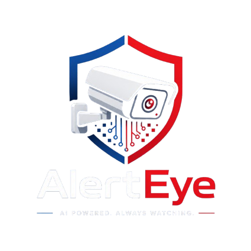

<p align="center">
  
</p>

# AlertEye

AI-powered CCTV surveillance system that detects **fire/smoke**, **weapons**, and **vehicle collisions** in real time, and pushes alerts to a companion mobile app. The web portal also includes an **AI assistant** (via OpenRouter) that answers visitor questions about the project directly on the site.

Final Year Project — BS Computer Science / Software Engineering, Iqra University, North Karachi Campus.

## What's in this repo

AlertEye has three parts that work together:

| Component | What it does | Stack |
|---|---|---|
| `desktop_app/` | Runs YOLOv8 detection on a live camera/RTSP feed/video file, triggers alerts | Python, PySide6, OpenCV, Ultralytics YOLOv8 |
| `web_app/` | Admin portal — user accounts, subscriptions, alert history, AI chat assistant | Flask, MySQL, Stripe, OpenRouter (LLM) |
| `andorid Project/` | Mobile app that receives push alerts in real time | Android (Java/Kotlin), Firebase Realtime Database |

You don't need all three to try it out — the **desktop app runs standalone** for detection. The web app and Android app add account management and mobile alerts on top.

## Quick start (desktop app only — fastest way to try it)

```bash
git clone https://github.com/yourusername/AlertEye.git
cd AlertEye/desktop_app

python -m venv venv
source venv/bin/activate        # Windows: venv\Scripts\activate

python setup_alerteye.py        # installs dependencies + downloads detection models
python main.py
```

That's it — a window opens with your camera feed and live detection.

## Full setup (all three components)

### 1. Desktop app

```bash
cd desktop_app
cp .env.example .env
```
Open `.env` and fill in what you need:
- `DESKTOP_API_SECRET` — only needed if you're also running the web app (must match its value there)
- `FIREBASE_SERVICE_ACCOUNT_PATH` — only needed if you want mobile push alerts (see step 3)

Then:
```bash
python -m venv venv
source venv/bin/activate
pip install -r requirements.txt
python setup_models.py          # downloads YOLO weights from HuggingFace (public, no token needed)
python main.py
```

### 2. Web app (admin portal + subscriptions)

```bash
cd web_app
python -m venv venv
source venv/bin/activate
pip install -r requirements.txt
cp .env.example .env
```
Fill in `.env`:
- `DATABASE_URL` — your local MySQL connection string
- `SECRET_KEY` — any long random string
- `MAIL_*` — Gmail SMTP + an [App Password](https://myaccount.google.com/apppasswords) (not your real Gmail password)
- `STRIPE_*` — get **test mode** keys free from your [Stripe dashboard](https://dashboard.stripe.com/test/apikeys)
- `OPENROUTER_API_KEY` — optional. Powers the AI chat assistant on the website (get a free key at [openrouter.ai](https://openrouter.ai)). If left blank, the assistant just tells visitors to use the contact page instead.

Create the database and load the schema:
```sql
CREATE DATABASE alerteye CHARACTER SET utf8mb4;
```
```bash
mysql -u root -p alerteye < ../alerteye_schema.sql
```
Run it:
```bash
python run.py
```

> The schema file has table structure only — no seed data. You'll need to sign up a fresh admin account through the app itself.

### 3. Android app (mobile alerts)

Requires **Android Studio** (JDK 11, min SDK 24).

1. In [Firebase Console](https://console.firebase.google.com), create a project → Realtime Database → generate a service account key (Project Settings → Service Accounts → Generate new private key)
2. Drop the downloaded JSON into `desktop_app/` and point `FIREBASE_SERVICE_ACCOUNT_PATH` in `desktop_app/.env` to it
3. In the same Firebase project, add an **Android app** (package name must match `applicationId` in `andorid Project/AlertEye/app/build.gradle.kts`) and download the generated `google-services.json`
4. Place that file at `andorid Project/AlertEye/app/google-services.json` — see `google-services.json.README.txt` in that folder for details. This file isn't committed to the repo since it's specific to each Firebase project.
5. Open Android Studio → **Open** → select `andorid Project/AlertEye`
6. Let Gradle sync and download dependencies
7. Connect a device or start an emulator, then **Run ▶**

## Detection modules

| Module | Model | Trigger |
|---|---|---|
| Fire & smoke | `fire_smoke.pt` (custom-trained YOLOv8n) | Visual fire/smoke detection |
| Weapon | `weapon_detection.pt` | Guns, knives |
| Vehicle collision | `accident_detection.pt` | Crash detection |

Models are downloaded automatically by `setup_models.py` — they're not committed to the repo (keeps clone size small). Confidence thresholds and which modules are active can be adjusted in `desktop_app/config/settings.json`.

## Alert channels

When something is detected, AlertEye can notify you through:
- **Desktop** — in-app alert + sound
- **Email** — via Gmail SMTP (configured in the web app)
- **Mobile push** — via Firebase Realtime Database → Android app
- **SMS/call** — via Twilio (optional)

## Security note for anyone deploying this

Never commit `.env`, `.env.production`, your Firebase **service account** JSON (the admin one from `desktop_app/`), or `google-services.json` (the Android config) — they're all gitignored here for a reason. If you're deploying to production, use your host's secret management (e.g. cPanel environment variables) instead of plain files where possible.

## Team

Built by [Ahmed] and team as a Final Year Project (FYP-2), 2026.
